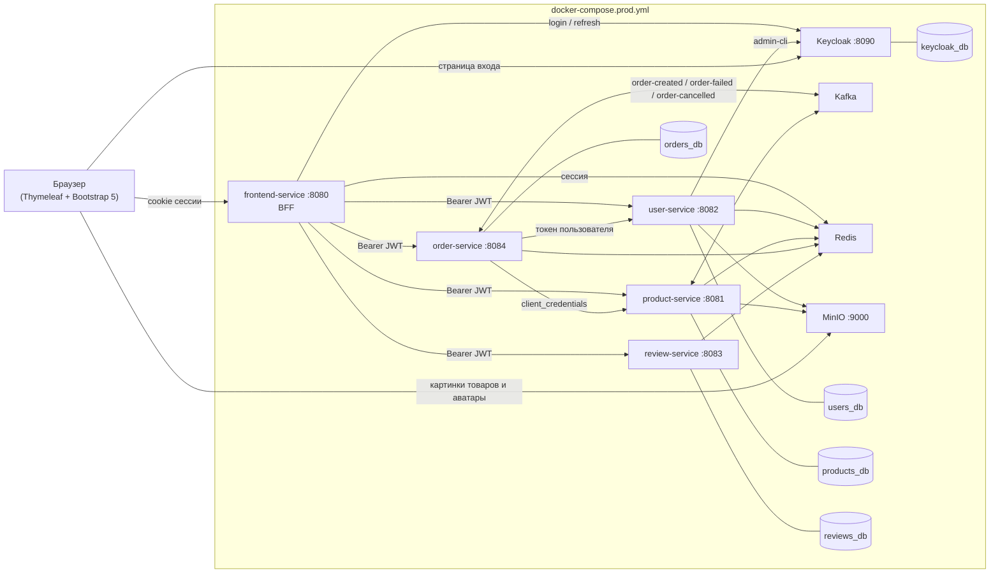
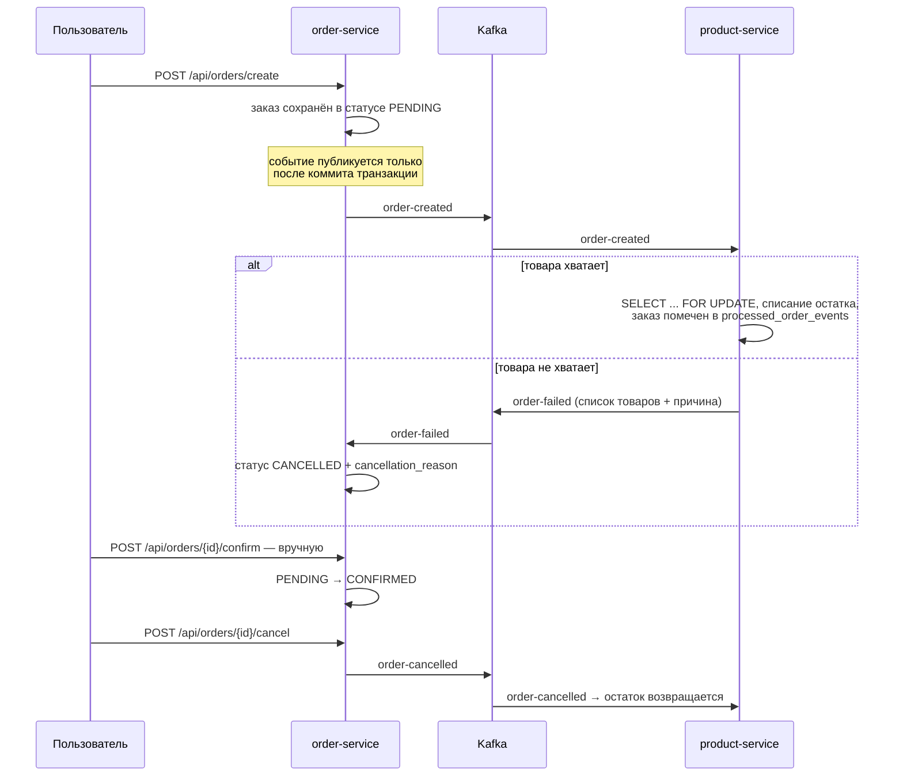

# Merchly 🛒

[](https://github.com/cvvexx/Merchly/actions/workflows/ci.yml)

Маркетплейс мерча на микросервисах: Java 17, Spring Boot 3.4.1, PostgreSQL, Redis, Kafka,
Keycloak, MinIO. Пять сервисов вокруг BFF-шлюза, асинхронное оформление заказа через Kafka,
сессии и кеш в Redis, интеграционные тесты на Testcontainers.

Весь стек поднимается одной командой вместе с демо-каталогом и тестовыми аккаунтами —
Java и Maven на хосте не нужны.

## 🚀 Быстрый старт

```bash
git clone https://github.com/cvvexx/Merchly.git && cd Merchly
cp .env.example .env.prod
docker compose --env-file .env.prod -f docker-compose.prod.yml up -d --build
```

Когда контейнеры станут `healthy` — http://localhost:8080.
Демо-аккаунт администратора: `ink_studio` / `demo1234`.

Подробности запуска, режим разработки, состав демо-данных и решение типовых проблем —
в [docs/Running.md](docs/Running.md).

## 📖 О проекте

Merchly — учебно-показательный проект интернет-магазина мерча, собранный как набор
независимых сервисов вокруг BFF-шлюза. Пять Spring Boot приложений в одном
Maven-мультимодуле:

* каждый сервис владеет своей базой (`merchly_users`, `merchly_products`,
  `merchly_orders`, `merchly_reviews`), связи между сущностями — только по UUID,
  без физических внешних ключей между базами;
* пользователь общается только с `frontend-service` (BFF), который рендерит
  Thymeleaf-страницы и сам ходит в остальные сервисы по внутренней сети Compose;
* заказ проходит через Kafka: `order-service` публикует событие, `product-service`
  списывает остатки и при нехватке товара присылает отказ.

## 🏗 Архитектура



| Сервис             | Порт | Зона ответственности                                                                                     |
|--------------------|------|----------------------------------------------------------------------------------------------------------|
| `frontend-service` | 8080 | BFF: Thymeleaf-страницы, сессия в Redis, обновление токенов, агрегация ответов остальных сервисов        |
| `product-service`  | 8081 | Каталог, поиск по названию, CRUD товаров (ADMIN), картинки в MinIO, списание и возврат остатков по Kafka |
| `user-service`     | 8082 | Регистрация в Keycloak + локальный профиль с тем же UUID, аватары в MinIO, корзина                       |
| `review-service`   | 8083 | Отзывы с пагинацией, один отзыв на товар от пользователя, агрегированная статистика оценок               |
| `order-service`    | 8084 | Заказы, статусы, история, интеграция с Kafka, OpenAPI-схема                                              |

Наружу пробрасывает порт только `frontend-service` и инфраструктура — бэкенд-сервисы
доступны лишь внутри сети Compose.

## 🛠 Технологический стек

| Категория            | Что используется                                                                    |
|----------------------|-------------------------------------------------------------------------------------|
| **Core**             | Java 17, Spring Boot 3.4.1, Maven (мультимодуль, 5 модулей)                         |
| **Архитектура**      | Микросервисы, BFF (Backend for Frontend)                                            |
| **Базы данных**      | PostgreSQL 16 — отдельный инстанс на каждый сервис, миграции Flyway                 |
| **Кеш и сессии**     | Redis 7 — Spring Cache в четырёх сервисах + Spring Session для сессий BFF           |
| **Асинхронность**    | Apache Kafka (KRaft) — три топика между `order-service` и `product-service`         |
| **Безопасность**     | Spring Security, Keycloak 24 (OIDC), JWT, resource server в каждом бэкенд-сервисе   |
| **Хранилище файлов** | MinIO (S3-совместимое), клиент `io.minio:minio`                                     |
| **Инфраструктура**   | Docker, Docker Compose (multi-stage сборка внутри контейнеров)                      |
| **Frontend**         | Thymeleaf, Bootstrap 5.3 (CDN), собственный CSS, ванильный JS с Fetch API           |
| **Тестирование**     | JUnit 5, Mockito, MockMvc, Testcontainers (Postgres, Redis, Kafka, MinIO), WireMock |
| **Документация API** | springdoc-openapi в `order-service` (`/swagger-ui.html`)                            |

## 🔐 Авторизация

Единственная точка входа для браузера — BFF. Схема входа:

1. Пользователь отправляет форму на `POST /do-login`.
2. `frontend-service` меняет логин/пароль на пару токенов у Keycloak
   (direct access grant клиента `merchly_frontend_client`).
3. Access- и refresh-токены кладутся в `KeycloakJwtAuthenticationToken` внутри
   HTTP-сессии. Сессия хранится **в Redis** (Spring Session), браузер получает
   только cookie с идентификатором сессии — сами JWT наружу не уходят и в
   `localStorage` не попадают.
4. `KeycloakTokenRefreshFilter` на каждом запросе проверяет `exp` access-токена и,
   если до истечения осталось меньше 10 секунд, прозрачно обновляет пару токенов
   через Keycloak. Если обновить не удалось — сессия инвалидируется и пользователя
   редиректит на `/login?error=session_expired`.
5. В бэкенд-сервисы BFF ходит с `Authorization: Bearer <access token>` — каждый из
   них является OAuth2 resource server со `SessionCreationPolicy.STATELESS` и сам
   валидирует подпись по JWKS Keycloak.

Для служебных вызовов, где нет пользователя, используется `client_credentials`:
`order-service` ходит в `/api/internal/products` под клиентом `merchly_orders_client`,
BFF — под `merchly_frontend_client`. Оба сервис-аккаунта имеют роль `INTERNAL_SERVICE`,
и внутренние эндпоинты закрыты `@PreAuthorize("hasRole('INTERNAL_SERVICE')")`.

CSRF на BFF включён (`CookieCsrfTokenRepository`), токен пробрасывается в страницы
мета-тегами и подставляется в fetch-запросы.

**Роли.** Живут в Keycloak (`ROLE_USER` — композитная роль по умолчанию, `ROLE_ADMIN` —
точечно) и дублируются в таблице `user_roles` user-service. `USER` покупает, оставляет
свои отзывы и управляет своими заказами; `ADMIN` дополнительно ведёт каталог, модерирует
чужие отзывы и видит чужие заказы. Проверки продублированы на BFF (`hasRole("ADMIN")`
в `SecurityBeans` и `sec:authorize` в шаблонах) и в самих сервисах.

## 📦 Оформление заказа (Kafka)



Что здесь важно:

* **Публикация после коммита.** `OrderKafkaEventListener` слушает доменное событие
  с `@TransactionalEventListener(AFTER_COMMIT)`, поэтому в Kafka не уйдёт событие
  по заказу, который не сохранился. Если брокер недоступен, ошибка логируется, а
  заказ остаётся в `PENDING`.
* **Идемпотентность.** `product-service` хранит обработанные заказы в таблице
  `processed_order_events` и повторную доставку `order-created` игнорирует;
  возврат остатка тоже выполняется только для реально списанного заказа.
* **Гонки по остатку.** Товары выбираются `findByIdForUpdate` (пессимистичная
  блокировка), так что параллельные заказы на последнюю единицу не уведут остаток в минус.
* **Статусы.** `PENDING → CONFIRMED` или `PENDING → CANCELLED`; подтверждение —
  ручное действие пользователя или админа, отдельного события «заказ подтверждён» нет.
  Страница заказа опрашивает `/orders/{id}/status`, поэтому асинхронная отмена
  из-за нехватки товара появляется на экране без перезагрузки.

## ⚡ Кеш, сессии и файлы

Redis выступает и кешем (`spring.cache.type=redis`, JSON-сериализация), и хранилищем
сессий BFF. Кеш включён в четырёх сервисах — каталог и карточка товара, корзина,
профили, заказы, статистика отзывов — с TTL от 2 до 10 минут и инвалидацией через
`@CacheEvict` в сервисном слое. Корзина при этом остаётся персистентной: она лежит
в таблице `cart_item` user-service, Redis только ускоряет чтение.
Полная раскладка кешей — в [docs/Running.md](docs/Running.md#кеши).

Дополнительные решения, особенности:

* при регистрации пользователь сначала создаётся в Keycloak, затем сохраняется
  локально с тем же UUID; если локальное сохранение упало — пользователь в Keycloak
  удаляется, а загруженный аватар подчищается в MinIO;
* в БД хранятся только имена файлов, публичные ссылки на MinIO собирает
  `ImageUrlFormatter` из `MINIO_PUBLIC_URL`;
* сообщения валидации вынесены из кода в `messages.properties` каждого сервиса
  (пока только русская локаль).

## ⚠️ Ограничения демо-сборки

Это учебный проект, и часть решений сделана ради простоты запуска:

* секреты (`.env.example`, `FRONTEND_SERVICE_CLIENT_SECRET`, ключи MinIO, пароль
  Keycloak `admin`/`admin`) лежат в репозитории в открытом виде;
* весь трафик внутри Compose идёт по HTTP, Keycloak работает в режиме `start-dev`;
* вход реализован через direct access grant, а не через redirect-флоу
  `authorization_code` — форма логина живёт на стороне BFF;
* интерфейс и сообщения валидации только на русском;
* уровень логирования Spring Security и REST-клиентов выставлен в `DEBUG`.

## 🧪 Тесты

```bash
mvn test        # юнит-тесты всех модулей
mvn verify      # + интеграционные тесты (*IT.java, нужен запущенный Docker)
```

Юнит-тесты покрывают сервисный слой (Mockito), контроллеры (MockMvc + `spring-security-test`),
REST-клиенты (WireMock) и Kafka-компоненты. Интеграционные тесты поднимают реальную
инфраструктуру через Testcontainers:

| Тест                       | Что поднимает                 | Что проверяет                                         |
|----------------------------|-------------------------------|-------------------------------------------------------|
| `ProductServiceIT`         | Postgres, Kafka, MinIO, Redis | сценарии каталога и обработку событий заказа          |
| `OrderApiIT`               | Postgres, Kafka, WireMock     | создание заказа и отмену по `order-failed`            |
| `OrderServiceRedisCacheIT` | Postgres, Redis               | что `@Cacheable`/`@CacheEvict` действительно работают |
| `UserApiIT`                | Postgres, Redis, MinIO        | регистрацию, профиль, загрузку аватара                |
| `CartServiceRedisCacheIT`  | Postgres, Redis               | кеш корзины и его инвалидацию                         |
| `ReviewApiIT`              | Postgres, Redis               | отзывы и агрегированную статистику                    |
| `ProductsListFlowIT`       | Redis, WireMock               | сквозной рендер списка товаров на BFF                 |

### CI

`.github/workflows/ci.yml` запускается на каждый push и pull request:

| Джоба            | Что делает                                                                                                                                             |
|------------------|--------------------------------------------------------------------------------------------------------------------------------------------------------|
| `Сборка и тесты` | JDK 17 (Temurin) + кеш Maven, `mvn compile`, затем `mvn verify` — юнит-тесты и Testcontainers-тесты; отчёты surefire/failsafe сохраняются как артефакт |
| `Сборка образов` | делает `.env.prod` и `.env.dev` из `.env.example`, валидирует оба compose-файла и собирает образы всех пяти сервисов                                   |

